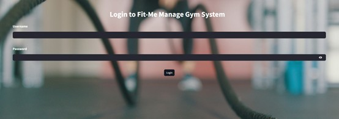
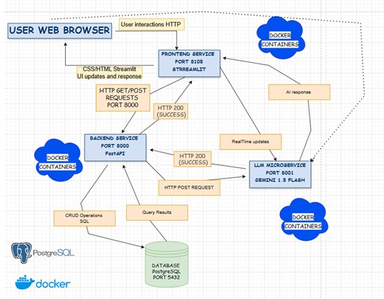

<h1 align="center">💪 FIT ME - Gym Management System 💪</h1>

<p align="center">
  
</p>

📖 Overview
✨ FitManage is a cutting-edge gym management system designed to streamline fitness center operations. It helps efficiently manage clients, staff, group lessons, personal training sessions, and memberships.

This system includes:

Backend powered by FastAPI ⚡
Frontend built with Streamlit 🎨
PostgreSQL database for data management 🐘
Integrated LLM-based microservice (Gemini AI) 🤖 for assisting gym employees with valuable insights and guidance.

🔹 The Gemini AI microservice helps gym staff by providing real-time assistance, answering questions, and offering workout recommendations for better client interactions.

## 🎥 Demo
<a href="https://www.youtube.com/watch?v=rFVFRGR11w0" target="_blank">
  
</a>

### **🛠️ Diagram **  
<p align="center">
  
</p>

🔹 **System Overview:**  
This diagram illustrates the architecture of the **FitMe Gym Management System**, showcasing the interactions between the **User Web Browser**, **Frontend Service**, **Backend Service**, **Database**, and the **LLM Microservice**.

### 🧑‍💻 User Web Browser  
- Users interact with the system via HTTP requests.
- The frontend updates the UI dynamically based on user interactions.

### 🎨 Frontend Service (Streamlit - Port 8501)  
- Handles UI updates and interactions using Streamlit.
- Sends requests to the backend for data processing.

### ⚙️ Backend Service (FastAPI - Port 8000)  
- Manages business logic, handles HTTP requests, and interacts with the database.
- Processes CRUD operations and sends query results back to the frontend.

### 📦 Database (PostgreSQL - Port 5432)  
- Stores client, staff, and session data.
- Handles SQL queries initiated by the backend.

### 🤖 LLM Microservice (Gemini AI - Port 8001)  
- Provides real-time AI assistance to gym staff.
- Processes requests for workout recommendations and general inquiries.

All services are containerized using **Docker**, ensuring seamless deployment and scalability. 🚀


## Technologies Used

### Backend
- **Python**: 3.10+
- **FastAPI**: A modern, fast web framework for APIs.
- **SQLAlchemy**: Database ORM for managing queries.
- **Pydantic**: For data validation and parsing.
- **psycopg2-binary**: PostgreSQL database adapter.

### Database
- **PostgreSQL**: Version 13 for relational data storage.

### Containerization
- **Docker**: Containerized backend for simplified deployment.
- **Docker Compose**: Manages multi-container services.

---

## Project Features

### Backend
- **User Authentication**: Login functionality for authorized staff.
- **Client Management**:
  - Manage potential and current clients.
  - Automatic task creation for follow-ups.
  - Move clients to a "Past Clients" archive.
- **Group Lessons**:
  - Schedule group lessons by day and time.
  - Fetch lesson schedules.
- **Personal Training**:
  - Manage and fetch personal training schedules.
- **Gym Staff**: Add and fetch staff details with specific roles.
- **Logging**: System-wide logging for debugging and auditing.

---

## Project Structure

```
manage_gym/
├── backend/
│   ├── app/
│   │   ├── __init__.py          # Empty initializer file
│   │   ├── main.py              # FastAPI backend logic and endpoints
│   │   ├── models.py            # Database models
│   │   ├── schemas.py           # Data validation schemas
│   │   ├── crud.py              # Database operations
│   │   ├── database.py          # Database connection setup
│   │   ├── enums.py             # Enums for multiple choice variables
│   ├── Dockerfile               # Backend container configuration
│   ├── requirements.txt         # Backend dependencies
├── docker-compose.yml           # Multi-container orchestration
└── README.md                    # Documentation
```

---

## Endpoints

### User Management
- **POST /login/**
  - Login with username and password.

### Client Management
- **POST /clients/**: Add a new client.
- **GET /clients/phone/{phone_number}**: Fetch client by phone number.
- **POST /clients/move_to_past/**: Move client to past clients.

### Task Management
- **POST /tasks/**: Create a new task.
- **GET /tasks/**: Fetch all tasks.
- **DELETE /tasks/{phone_number}**: Delete a task by phone number.

### Group Lessons
- **POST /group_lessons/**: Add a new group lesson.
- **GET /group_lessons/**: Fetch all group lessons.

### Personal Training
- **POST /personal_trainings/**: Add a personal training session.
- **GET /personal_trainings/schedule/**: Fetch the weekly training schedule.

---

## How to Run the Project

### Prerequisites
- Docker and Docker Compose installed.

### Steps
1. **Clone the Repository**:
   ```bash
   git clone https://github.com/miri-y/manage_gym.git
   cd manage_gym
   ```
2. **Build and Run Containers**:
   ```bash
   docker-compose up --build
   ```
   - The backend will be available at: `http://localhost:8000`
   - Explore API docs at: `http://localhost:8000/docs`

3. **Access PostgreSQL**:
   ```bash
   docker exec -it manage_gym_postgres psql -U gym_admin -d manage_gym_db
   ```

---

## Future Work
- Add a compatible frontend to interact with the backend.
- Update the backend to meet the requirements of the frontend.
- Create a user-friendly design for the application.
- Improve communication between backend and frontend components.

---

## Contact Info
**Project Author**: Miri Y.  
**Email**:(mailto:miriamyakobson200021@gmail.com)  
**GitHub**: [miri-y](https://github.com/miri-y)

