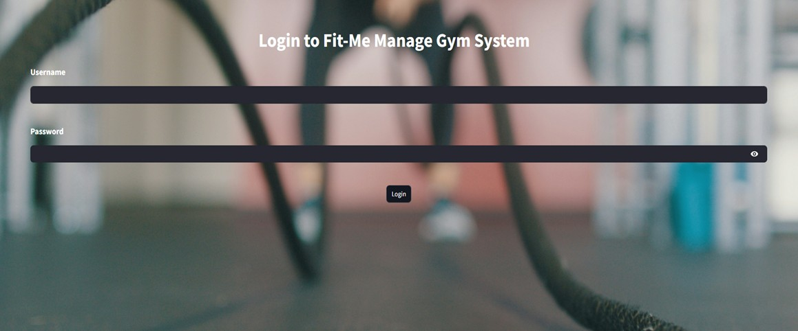

<h1 align="center">💪 FIT ME - Gym Management System 💪</h1>

<p align="center">
  
</p>

## 📖 Overview  

**FitManage** **is a cutting-edge gym management system designed to streamline fitness center operations. It helps efficiently manage clients, staff, group lessons, personal training sessions, and memberships.**

### 🔹 This system includes:
- **⚡ Backend powered by FastAPI**
- **🎨 Frontend built with Streamlit**
- **🗄️ PostgreSQL database for data management**
- **🤖 Integrated LLM-based microservice (Gemini AI) for assisting gym employees with valuable insights and guidance.**

🔹 **The Gemini AI microservice helps gym staff by providing real-time assistance, answering questions, and offering workout recommendations for better client interactions.**  

---

## 🎥 Demo  

<p align="center">
  <a href="https://www.youtube.com/watch?v=rFVFRGR11w0" target="_blank">
    
  </a>
</p>

---

## 🛠️ System Architecture  

<p align="center">
  
</p>

### 🔹 System Overview  
**This diagram illustrates the architecture of the **FitMe Gym Management System**, showcasing the interactions between the **User Web Browser**, **Frontend Service**, **Backend Service**, **Database**, and the **LLM Microservice**.**

### 🧑‍💻 User Web Browser  
- **Users interact with the system via HTTP requests.**
- **The frontend updates the UI dynamically based on user interactions.**

### 🎨 Frontend Service (Streamlit - Port 8501)  
- **Handles UI updates and interactions using Streamlit.**
- **Sends requests to the backend for data processing.**

### ⚙️ Backend Service (FastAPI - Port 8000)  
- **Manages business logic, handles HTTP requests, and interacts with the database.** 
- **Processes CRUD operations and sends query results back to the frontend.**  

### 📦 Database (PostgreSQL - Port 5432)  
- **Stores client, staff, and session data.**  
- **Handles SQL queries initiated by the backend.**

### 🤖 LLM Microservice (Gemini AI - Port 8001)  
- **Provides real-time AI assistance to gym staff.**
- **Processes requests for workout recommendations and general inquiries.**

🔹 **All services are containerized using Docker, ensuring seamless deployment and scalability.** 🚀  

---

## 🛠️ Technologies Used  

### 🖥️ Backend:
- **Python 3.10+** – **The core programming language for the backend.** 
- **FastAPI ⚡** – **A modern and fast web framework for building APIs.**
- **SQLAlchemy 🗃️** – **ORM for database management.**  
- **PostgreSQL 🐘** – **Relational database for storing gym-related data.**   

### 🎨 Frontend:
- **Streamlit 🎭** – **A lightweight Python framework for building an interactive user interface.**  

### 🧠 AI Microservice:
- **Gemini AI 🤖** – **An LLM-based microservice providing real-time assistance to gym staff.**
- **FastAPI-based LLM Service 🚀** – **Handles AI interactions and suggestions for trainers and staff.**  

### 🗄️ Database:
- **PostgreSQL 🐘** – **A powerful open-source relational database storing all user, training, and membership data.**

### 🐳 Containerization:
- **Docker 🐳** – **Creates isolated containers for the backend, frontend, database, and LLM microservice.**
- **Docker Compose 🔧** – **Orchestrates multi-container services, ensuring smooth interaction between all components.**

---

## 🚀 Project Features  

### 🏋️ Client & Membership Management  
- **Register, view, and manage** gym members easily.  
- **Move past members** to an archive for history tracking.  

### 📅 Group Lessons & Personal Training  
- **Schedule, update, and cancel** group lessons with assigned trainers.  
- **View an organized weekly schedule** of group lessons and personal training.  

### 🔥 Lead & Task Management  
- **Store and manage** potential client leads.  
- **Automatically generate follow-up tasks** for interested clients.  
- **Track and update** lead status for gym sales team.  

### 🏢 Gym Staff Management  
- **Add, view, and manage** gym employees (trainers, receptionists, managers).  
- **Assign roles** with responsibilities (trainer, receptionist, manager).  

### 🤖 AI-Powered Assistance (Gemini AI)  
- **Receive real-time suggestions** for client fitness programs.  
- **Get instant AI-powered insights** for gym operations and customer service.  
- **Help gym staff** with fitness-related queries using natural language processing.  

🔹 **This system streamlines gym operations, optimizes staff workflow, and enhances client engagement!** 🚀💪  

---

## 🗂️ Project Structure 🗂️

```
manage_gym/
├── README.md
├── READMEPHOTO.jpg
├── backend
│   ├── Dockerfile
│   ├── app
│   │   ├── __init__.py
│   │   ├── crud.py
│   │   ├── database.py
│   │   ├── main.py
│   │   ├── models.py
│   │   └── schemas.py
│   ├── db
│   │   └── db_backup_data.sql
│   ├── llm_service
│   │   ├── Dockerfile
│   │   ├── app
│   │   │   ├── __init__.py
│   │   │   ├── __pycache__
│   │   │   │   ├── __init__.cpython-310.pyc
│   │   │   │   ├── gemini_client.cpython-310.pyc
│   │   │   │   ├── main.cpython-310.pyc
│   │   │   │   └── prompt_templates.cpython-310.pyc
│   │   │   ├── config
│   │   │   │   ├── __init__.py
│   │   │   │   ├── __pycache__
│   │   │   │   │   ├── __init__.cpython-310.pyc
│   │   │   │   │   └── settings.cpython-310.pyc
│   │   │   │   └── settings.py
│   │   │   ├── gemini_client.py
│   │   │   ├── main.py
│   │   │   ├── prompt_templates.py
│   │   │   └── utils.py
│   │   └── requirements.txt
│   ├── requirements.txt
│   └── tests
│       ├── confest.py
│       └── test_routes.py
├── docker-compose.yml
├── frontend
│   ├── Dockerfile
│   ├── __pycache__
│   │   └── main.cpython-310.pyc
│   ├── app
│   │   ├── __pycache__
│   │   │   ├── dashboard.cpython-310.pyc
│   │   │   ├── login.cpython-310.pyc
│   │   │   └── utils.cpython-310.pyc
│   │   ├── assets
│   │   │   ├── BackgroundSystem.jpg
│   │   │   └── LoginPhoto.jpg
│   │   ├── dashboard.py
│   │   ├── dashboard_services
│   │   │   ├── __init__.py
│   │   │   ├── __pycache__
│   │   │   │   ├── __init__.cpython-310.pyc
│   │   │   │   ├── add_interested_client.cpython-310.pyc
│   │   │   │   ├── birthday_page.cpython-310.pyc
│   │   │   │   ├── chatbot.cpython-310.pyc
│   │   │   │   ├── client_management.cpython-310.pyc
│   │   │   │   ├── group_lessons.cpython-310.pyc
│   │   │   │   ├── gym_staff.cpython-310.pyc
│   │   │   │   ├── personal_trainings.cpython-310.pyc
│   │   │   │   └── task_management.cpython-310.pyc
│   │   │   ├── add_interested_client.py
│   │   │   ├── birthday_page.py
│   │   │   ├── chatbot.py
│   │   │   ├── client_management.py
│   │   │   ├── group_lessons.py
│   │   │   ├── gym_staff.py
│   │   │   ├── personal_trainings.py
│   │   │   └── task_management.py
│   │   └── login.py
│   ├── main.py
│   └── requirements.txt
├── newdiagram.jpg
├── readme1.jpg
└── readme2.jpg
```
---

## Project Setup 🛠️

Clone the repository:

```sh
git clone git@github.com:EASS-HIT-PART-A-2024-CLASS-VI/FIT-ME.git
cd FIT-ME
```
---

### 🔑 **Setting Up the .env File**  

To enable **Google Gemini AI**, you must create an API key from [Google AI Studio](https://aistudio.google.com/app/apikey).

Then, create a `.env` file in the general directory and fill it with:

```sh
GEMINI_API_KEY=<YOUR_API_KEY>
```

The key should not be shared, it is personal, and `.env` should always be in `.gitignore`.

**Make the `.env` file in the general directory:**

```sh
nano .env
```
---

## 🗄️ **Setting Up the Database**
**To ensure that the PostgreSQL database is properly set up with preloaded data, follow these steps:**
### 📌 **Starting the Database Service**
**Run the following command to build and start all services, including the database, in detached mode:**
```sh
docker-compose up --build -d
```
```sh
docker cp backend/db/db_backup_data.sql manage_gym_postgres:/db_backup_data.sql
```
```sh
docker exec -it manage_gym_postgres psql -U gym_admin -d manage_gym_db -f /db_backup_data.sql 2>/dev/null
```
**This will make all our microservices run in parallel using DOCKER COMPOSE**
-   **Frontend**: [http://localhost:8501](http://localhost:8501)
-   **Backend API Docs**: [http://localhost:8000/docs](http://localhost:8000/docs)
-   **LLM Microservice**: http://localhost:8001/docs

## 🎨 **Enable Dark Mode & Wide Mode for Correct System Display**

For the system to function **correctly**, **Dark Mode** and **Wide Mode** must be enabled. This ensures the best visual experience and correct layout.

### 🌙 **Enable Dark Mode**
1. Click on the three dots **(⋮)** in the top-right corner of the app.
2. Select **Settings** from the dropdown menu.
   <p align="left">
     
   </p>

3. In the **Settings** panel, find the **Appearance** section.
4. Choose **Dark Mode** from the dropdown menu.
   <p align="left">
     
   </p>
   
### 📺 **Enable Wide Mode**
1. In the **Settings** panel (as shown above), check the box labeled **Wide mode**.

🚨 **Important:** The system is designed to run in **Dark Mode & Wide Mode**.  
This is the **only correct way** to use the application.

---

## 🧪 **Running Tests**

**To ensure that the system works correctly, you can run **automated tests** using `pytest`. These tests validate key functionalities such as** **user authentication, client management, task creation, and gym staff operations**.

### 📌 **How to Run Tests**
**Before running the backend tests, ensure that the system is up and running. If it is not running, start it with:**

```bash
docker-compose up --build -d
```

**Once the system is running, execute the following command to run all tests:**

```bash
docker exec -it manage_gym_backend pytest /app/tests --disable-warnings
```

✅ **This command will execute all test cases located in the `backend/tests/` directory.**

 **By running these tests, you can ensure that all core functionalities of the system backend are operating correctly!** 🎯

---

## ⚡ **Backend API**
The FastAPI backend handles:
- **Client and membership management**
- **Group lesson and personal training scheduling**
- **Staff management**
- **Task tracking**
- **Authentication**
- **AI chatbot integration**

### 📌 **API Endpoints**
### **User Authentication API**
- **`POST /login/`** - Authenticate user credentials
- **`POST /logout/`** - End user session
- **`POST /users/`** - Add a new user
- **`GET /users/`** - Retrieve all users
- **`DELETE /users/{username}`** - Delete a user

### **Client Management API**
- **`POST /clients/`** - Register a new client
- **`GET /clients/`** - Retrieve all clients
- **`GET /clients/phone/{phone_number}`** - Find client by phone number
- **`GET /clients/id/{id_number}`** - Find client by ID number
- **`POST /clients/move_to_past/`** - Move client to past clients
- **`GET /past_clients/`** - Retrieve all past clients
- **`POST /interested_clients/`** - Add an interested client

### **Task Management API**
- **`POST /tasks/`** - Create a new task
- **`GET /tasks/`** - Get all tasks
- **`DELETE /tasks/{phone_number}`** - Delete a task

### **Class & Training API**
- **`POST /group_lessons/`** - Create a group lesson
- **`GET /group_lessons/`** - Get all group lessons
- **`GET /group_lessons/schedule/`** - Get lessons organized by day
- **`DELETE /group_lessons/`** - Delete a group lesson
- **`POST /personal_trainings/`** - Schedule a personal training
- **`GET /personal_trainings/schedule/`** - Get training schedule
- **`DELETE /personal_trainings/`** - Cancel a training session

### **Staff Management API**
- **`POST /gym_staff/`** - Add new staff member
- **`GET /gym_staff/`** - Get all staff members
- **`DELETE /gym_staff/{staff_id}`** - Remove a staff member

### **AI Integration API**
- **`POST /api/llm/chat`** - Get AI responses to fitness/gym queries

---

## 🗄️ **Database**
**FitMe uses PostgreSQL as its database, with the following tables:**
- **users** - System users with authentication credentials
- **clients** - Active gym members
- **past_clients** - Former gym members
- **interested_clients** - Potential clients who've shown interest
- **tasks** - Follow-up tasks for staff
- **group_lessons** - Scheduled group fitness classes
- **personal_trainings** - One-on-one training sessions
- **gym_staff** - Gym employees and trainers

**Database operations are managed in `crud.py`, with schemas defined in `schemas.py` and models in `models.py`.**

---

## 🎨 **Frontend UI Pages**

The Streamlit UI provides a modern, user-friendly gym management experience with intuitive pages:

### ✨ **UI Pages**
- **📊 Dashboard** - Central navigation hub with access to all system services and a convenient logout button.
- **🔐 Login Page** - Secure authentication interface with username/password fields against backend verification.
- **👤 Client Management** - Comprehensive interface for registering, searching, and managing gym members with Excel export functionality.
- **🆕 Add Interested Client** - Simple form to capture potential client information that automatically generates follow-up tasks.
- **📝 Task Management** - Organizes follow-up tasks with creation and deletion capabilities for staff to track leads.
- **📆 Group Lessons** - Interactive schedule display with tools to add/delete classes and export timetables to Excel.
- **💪 Personal Trainings** - Day-by-day training session management with trainer-trainee assignment functionality.
- **👥 Gym Staff** - Staff directory with role management and system user administration capabilities.
- **🎂 Birthdays** - Celebration tracker showing upcoming birthdays for both clients and staff members.
- **🤖 AI Chatbot** - Gemini-powered assistant that provides instant fitness and nutrition guidance to staff.

<p align="center">
  
</p>

---

## 🤖 **LLM Microservice**

The system integrates Google's Gemini 1.5 Pro model as an AI assistant through a dedicated microservice:

- **FastAPI Backend** - Handles API requests and communicates with the Gemini API
- **Specialized Knowledge** - Pre-configured with gym & fitness domain expertise
- **System Prompt** - Comprehensive prompt template covering fitness, nutrition, strength training, injury prevention, and gym operations
- **Contextual Responses** - Provides tailored advice based on user queries and context
- **Integration** - Seamlessly connects with the main application through HTTP endpoints
- **Error Handling** - Robust error management for reliable operation

The LLM service enhances staff capabilities by providing instant, accurate information about workout plans, nutrition advice, training techniques, and gym management best practices without requiring specialized knowledge from every staff member.

## 🙌 **Thank You!**

Thank you for your time! I hope everything was clear. For any questions or suggestions, feel free to reach out. 😊


## Contact Info
**Project Author**: Miri Y.  
**Email**:(mailto:miriamyakobson200021@gmail.com)  
**GitHub**: [miri-y](https://github.com/miri-y)

